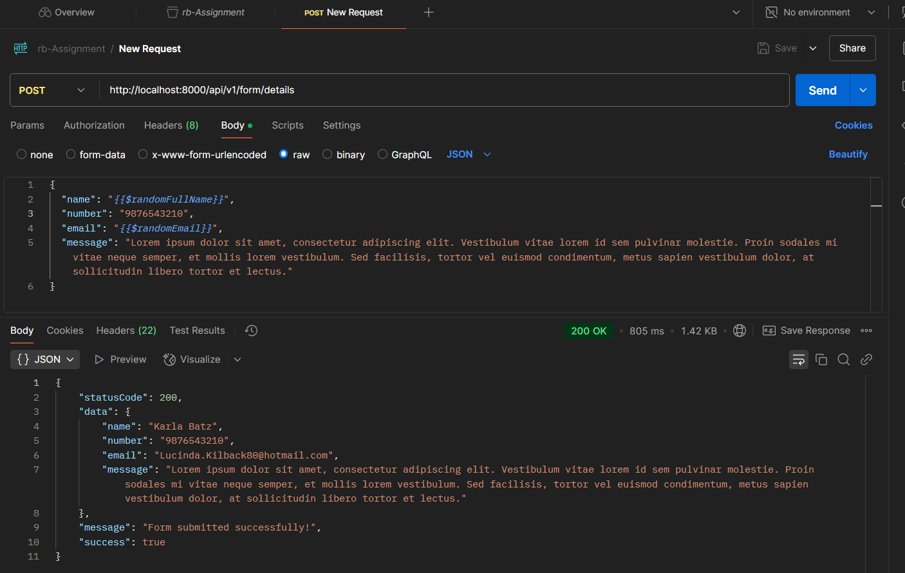
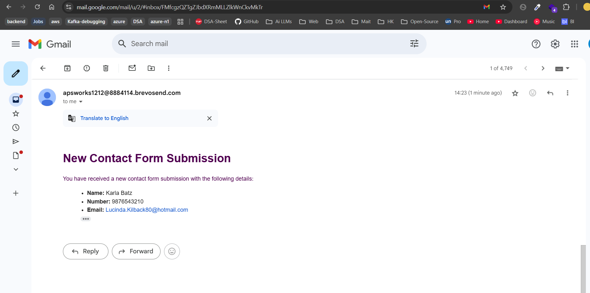
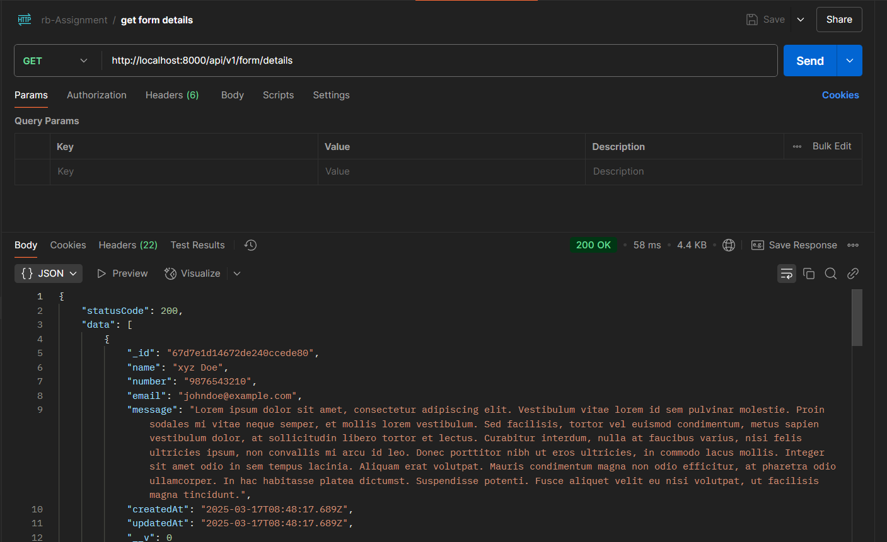
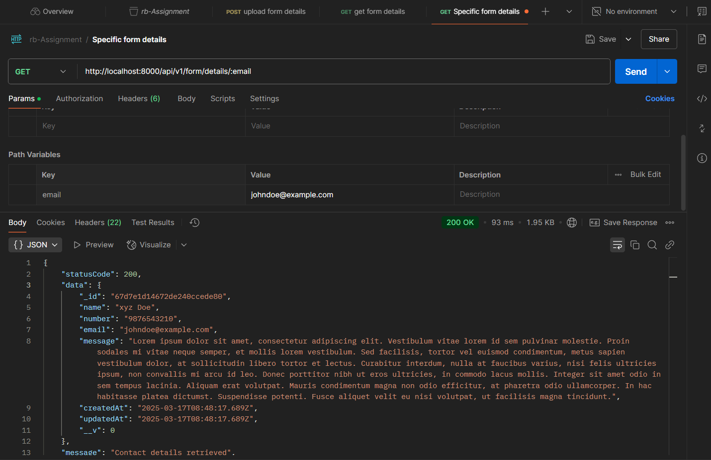

# Authentication System

This is a backend assignment for contact form.

-----

# 1.0 Prequisite
- Node version 22+
- MoongoDB (atlas) account

-----

# 2.0 Installation

### Install the project by cloning this repo from your terminal.

- Step 1: Clone the Repo

```bash
 git clone https://github.com/abhyuday1212/Rtc-Assignment.git
```

```bash
 npm i
```

- If any ERR ocured in terminal the use this command and reinstall the dependencies using this line

```bash
  npm i --force
```

### Create .env file by copying the variable names from .env.sample


### Run the backend server.

- Goto #root folder and run these commands in your powershell.

```bash
  npm start
```

- If terminal returns Port started successfully at ${PORT} & Databse connected successfully than you are good to go.


---

backend is accessible at http://localhost:8000

---

# 3.0 Tech Stack

_Server Packages:_ Typescript, MongoDB, Express.js , Node.js.

 

# 5.0 Postman Link

```bash
https://backend-assignment-7713.postman.co/workspace/New-Team-Workspace~4ca46450-30c8-4a53-81cf-c2aad564b131/collection/29496688-3ed3ded7-b150-4228-a151-027f00c0665d?action=share&creator=29496688
```


### My Results







 
